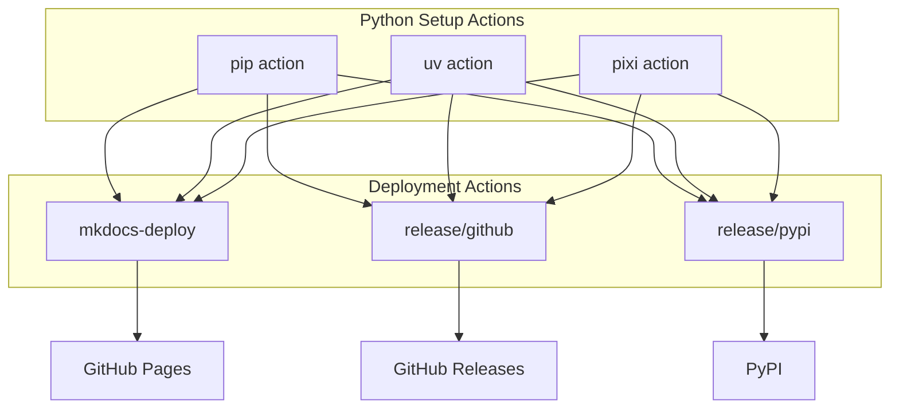

# Serapieum GitHub Actions

Reusable GitHub Actions for Python CI/CD workflows. Cross-platform, multi-package-manager, production-ready.

## Actions at a Glance

| Action | Purpose | Package Managers |
|--------|---------|-----------------|
| [python-setup/pip](python-setup/pip.md) | Python environment with pip | pip |
| [python-setup/uv](python-setup/uv.md) | Python environment with uv | uv |
| [python-setup/pixi](python-setup/pixi.md) | Python environment with pixi | pixi |
| [mkdocs-deploy](mkdocs-deploy.md) | MkDocs to GitHub Pages with versioning | pip, uv, pixi |
| [release/github](release/github/README.md) | Version bump + GitHub release via Commitizen | pip, uv, pixi |
| [release/pypi](release/pypi/README.md) | Build and publish to PyPI | pip, uv, pixi |

## Quick Start

=== "uv (recommended)"

    ```yaml
    steps:
      - uses: actions/checkout@v5
      - uses: serapeum-org/github-actions/actions/python-setup/uv@uv/v1
        with:
          install-groups: 'groups: dev test'
    ```

=== "pip"

    ```yaml
    steps:
      - uses: actions/checkout@v5
      - uses: serapeum-org/github-actions/actions/python-setup/pip@pip/v1
        with:
          cache: 'pip'
          install-groups: 'extras: dev test'
    ```

=== "pixi"

    ```yaml
    steps:
      - uses: actions/checkout@v5
      - uses: serapeum-org/github-actions/actions/python-setup/pixi@pixi/v1
        with:
          environments: 'default'
    ```

## Key Features

- **Cross-platform** - Windows, macOS, Linux
- **Multiple package managers** - pip, uv, pixi
- **Dependency groups** - PEP 735 support (groups) and optional dependencies (extras)
- **Lock file verification** - Reproducible builds by default
- **Caching** - Faster CI with dependency caching
- **Versioned releases** - Namespaced semantic versioning per action

## Architecture



## Versioning

Actions use **namespaced tags** for independent releases:

```
pip/v1.0.0    pip/v1
uv/v1.2.0     uv/v1
pixi/v1.0.0   pixi/v1
```

Pin to a major version for automatic bug fixes:

```yaml
uses: serapeum-org/github-actions/actions/python-setup/uv@uv/v1
```

See the [Versioning Guide](VERSIONING.md) for details.
