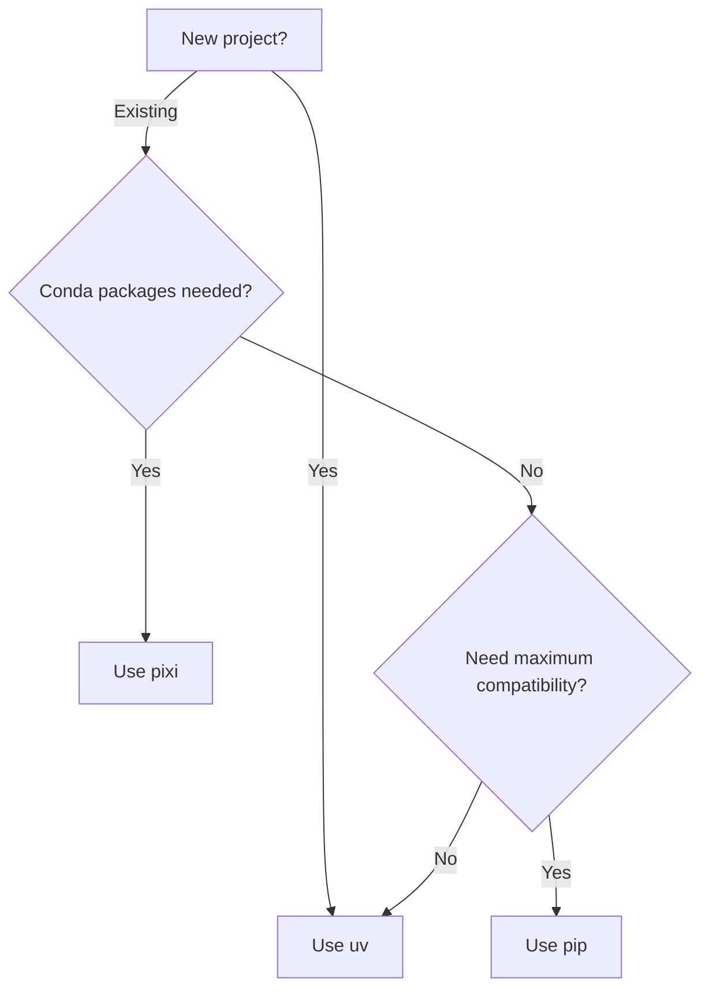

# Python Setup Actions

Three composite actions for setting up Python environments in GitHub Actions, each targeting a different package manager.

## Comparison

| Feature | [pip](pip.md) | [uv](uv.md) | [pixi](pixi.md) |
|---------|:---:|:---:|:---:|
| Speed | Moderate | Fast | Fast |
| PEP 735 dependency groups | Partial | Full | N/A (uses environments) |
| Optional dependencies (extras) | Yes | Yes | N/A |
| Lock file verification | No | Yes | Yes |
| Virtual environment activation | N/A | Yes | Yes |
| Caching | Via setup-python | Built-in (uv) | Optional |
| Conda packages | No | No | Yes |
| Cross-platform | Yes | Yes | Yes |

## Which One Should I Use?



- **uv** - Recommended for most projects. Fastest resolver, full PEP 735 support, built-in caching.
- **pip** - Best when you need maximum compatibility or your project already uses pip.
- **pixi** - Required when you need conda packages or multi-environment setups.

## Common Inputs

All three actions accept `python-version` (default: `'3.12'`).

**pip and uv** share the `install-groups` input format:
```
'groups: dev test, extras: aws viz'
```

**pixi** uses `environments` instead:
```
'default py312 py313'
```

## Quick Examples

=== "pip"

    ```yaml
    - uses: Serapieum-of-alex/github-actions/actions/python-setup/pip@pip/v1
      with:
        python-version: '3.12'
        cache: 'pip'
        install-groups: 'extras: dev test'
    ```

=== "uv"

    ```yaml
    - uses: Serapieum-of-alex/github-actions/actions/python-setup/uv@uv/v1
      with:
        python-version: '3.12'
        install-groups: 'groups: dev test'
    ```

=== "pixi"

    ```yaml
    - uses: Serapieum-of-alex/github-actions/actions/python-setup/pixi@pixi/v1
      with:
        environments: 'default'
    ```
